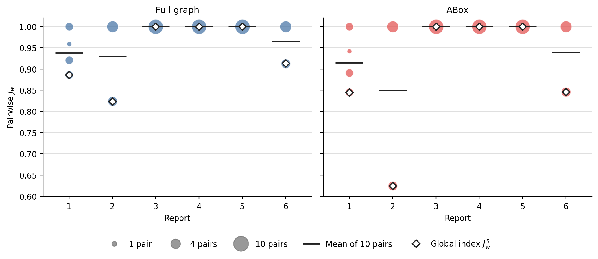
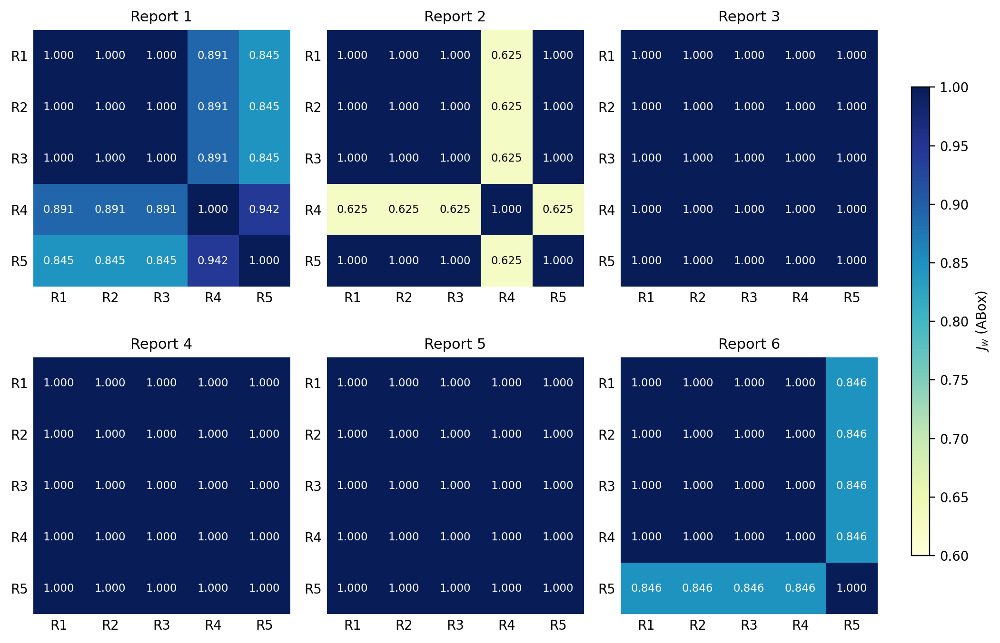
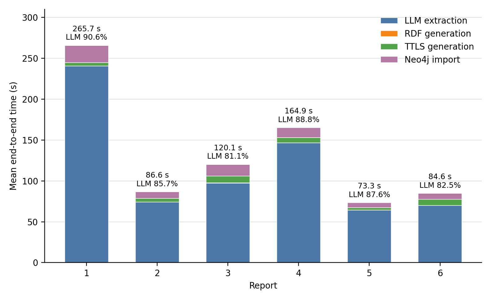
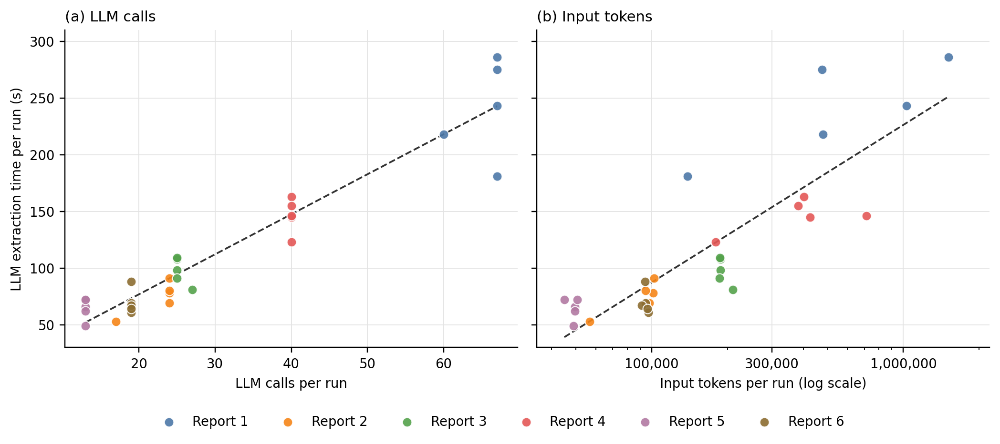
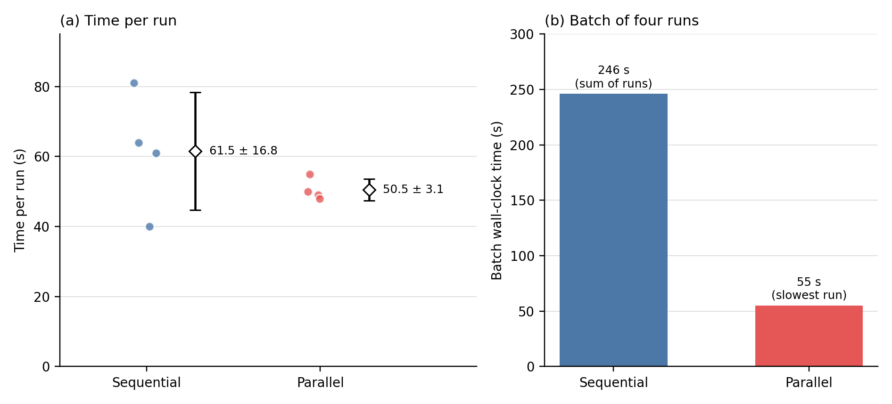

# Illustrative example: run-to-run consistency and pipeline performance

## Experimental design

The corpus consists of six police reports. Together they total 35 pages and 8,669 words; individually they range from 2 to 12 pages and from 444 to 3,066 words.

Each report was processed in five independent runs of the full pipeline, which has four stages:

1. extraction with the language model;
2. RDF graph generation;
3. TTLS file generation;
4. import into Neo4j.

The result is 30 RDF/XML graphs that instantiate the property-crime ontology (namespace `delito_contra_patrimonio`). The five runs of each report are denoted R1–R5 (R1 is the base run; R2–R5 are repetitions 1–4).

In addition, report 5, the closest to the mean in document size, was processed four times in each of two execution modes, to compare execution time and output stability:

- **sequential:** the four runs are launched one after another;
- **parallel:** the four runs are launched simultaneously.

## Test environment

The reference deployment uses Docker Compose with three services:

- **backend:** FastAPI served with Uvicorn in a single worker (no `--workers` flag).
- **database:** Neo4j 5.25 with the APOC and neosemantics plugins; the heap size is not set explicitly.
- **frontend:** the web interface.

`docker-compose.yml` declares no CPU or memory limits, so the resources available to the containers are those assigned by Docker Desktop on WSL2.

The test machine has an Intel Core i3-1115G4 processor (2 physical cores, 4 logical processors) and 8 GB of RAM. There is no `.wslconfig` file, so WSL2 applies its defaults: all logical processors and up to 50% of physical RAM. The resulting environment offers Docker Desktop 4 CPUs and 3.63 GB of RAM.

LLM inference is performed outside this environment, through the OpenRouter API, and therefore consumes no local resources. The pipeline uses two OpenAI models:

- **M Chat, the main model:** `openai/chat-latest`, OpenAI's alias for its latest ChatGPT Instant chat model (openai/GPT-6.5 chat sol). The alias changes as OpenAI releases new versions.
- **M mini, the lightweight model:** GPT-5.2 mini.

Because the backend uses a single Uvicorn worker, the four simultaneous runs of the parallel mode are served by a single process, not by separate worker processes.

## Consistency metric

The IRIs of individuals are generated from the free text of the report, so they change between runs even when the extracted structure is the same. Only 2 of the 60 run pairs share the same set of individual IRIs. A set-based Jaccard over exact triples (excluding those that contain blank nodes) gives a mean of 0.605 across reports, with per-report means between 0.471 and 0.894. Comparing IRIs directly would therefore conflate name variability with genuine structural disagreement.

For this reason the graphs are compared at the level of **triple shapes**. Each triple $(s, p, o)$ is converted into a shape $f$ as follows:

- the predicate $p$ is kept;
- each individual is replaced by the set of its named classes (e.g. `<d:StolenGoods>`);
- vocabulary terms (classes and properties) are kept as they are;
- each literal is replaced by its datatype;
- each blank node is replaced by a recursive canonical signature of its structure, which does not depend on its identifier.

Let $c_X(f)$ be the number of triples in graph $X$ that correspond to shape $f$. Each graph thus becomes a multiset of shapes, and two runs $A$ and $B$ are compared with the weighted multiset Jaccard index, also called Ruzicka similarity:

$$
J_w(A,B)=\frac{\sum_f \min\big(c_A(f),\,c_B(f)\big)}{\sum_f \max\big(c_A(f),\,c_B(f)\big)} \in [0,1].
$$

Unlike the set version, $J_w$ penalizes differences in *how many* entities of each type are extracted, not just whether a type is present. For the five runs of a report, three summaries are given: the 10 pairwise values, their mean, and the global index $J_w^{5}=\sum_f \min_i c_i(f)\,/\,\sum_f \max_i c_i(f)$.

The metric is computed at two scopes:

- **Full graph** includes the TBox declarations (`owl:Class`, `owl:ObjectProperty`, `rdfs:label`, …) that the pipeline writes in every file.
- **ABox** restricts the comparison to triples whose subject is an individual, i.e. to the facts extracted from the report.

The ABox scope is the more demanding and informative of the two.

## Consistency results

**Table 1.** Run-to-run consistency per report (5 runs, 10 pairs each). The mean ± SD and the minimum are computed over the 10 pairwise values; $J_w^{5}$ is the global index over the five runs.

| Report | Triples/run (full / ABox) | Shapes/run (full / ABox) | $J_w$ full: mean ± SD | min. | $J_w^{5}$ | $J_w$ ABox: mean ± SD | min. | $J_w^{5}$ |
|---|---|---|---|---|---|---|---|---|
| 1 | 74.2 / 53.2 | 34.6 / 13.6 | 0.938 ± 0.048 | 0.886 | 0.886 | 0.915 ± 0.066 | 0.845 | 0.845 |
| 2 | 32.8 / 14.8 | 28.0 / 10.0 | 0.929 ± 0.091 | 0.824 | 0.824 | 0.850 ± 0.194 | 0.625 | 0.625 |
| 3 | 50.0 / 23.0 | 46.0 / 19.0 | 1.000 ± 0.000 | 1.000 | 1.000 | 1.000 ± 0.000 | 1.000 | 1.000 |
| 4 | 49.0 / 32.0 | 31.0 / 14.0 | 1.000 ± 0.000 | 1.000 | 1.000 | 1.000 ± 0.000 | 1.000 | 1.000 |
| 5 | 22.0 / 12.0 | 18.0 / 8.0 | 1.000 ± 0.000 | 1.000 | 1.000 | 1.000 ± 0.000 | 1.000 | 1.000 |
| 6 | 45.2 / 25.2 | 36.0 / 16.0 | 0.965 ± 0.045 | 0.913 | 0.913 | 0.938 ± 0.079 | 0.846 | 0.846 |
| **All (60 pairs)** | | | **0.972 ± 0.053** | 0.824 | 0.937 | **0.951 ± 0.103** | 0.625 | 0.886 |

**Overall agreement.** Across the 60 run pairs, the mean shape agreement is 0.972 for the full graph and 0.951 for the ABox. Forty-five pairs (75%) yield identical shape multisets at both scopes.

**Fully consistent reports.** Reports 3, 4 and 5 are perfectly consistent: $J_w = 1$ in all ten pairs and $J_w^{5} = 1$. In these three reports no pair of runs shares the same set of individual IRIs, so the observed variability is purely lexical.

**Lowest agreement.** The lowest value occurs in the ABox of report 2, where both the minimum and the global index are 0.625 (Fig. 1).

**Structure of the disagreement.** The pairwise matrices (Fig. 2) show a block pattern: runs that agree with each other are identical. The disagreement comes from a single discordant run in reports 2 and 6, and from two runs in report 1.

- **Report 1**: R1–R3 extract 8 stolen items. R4 extracts only 7 (one item is missing). R5 also has 7 items typed as `StolenGoods`, plus one individual without a declared `rdf:type` (the eighth item is present but untyped, so it is not counted as stolen goods).
- **Report 2**: R4 does not duplicate the stolen item (1 individual instead of 2), halving the number of relations associated with that item.
- **Report 3**: perfectly stable across the five runs, in types and attributes as well as in cardinality.
- **Report 4**: perfectly stable across the five runs.
- **Report 5**: perfectly stable across the five runs.
- **Report 6**: R1–R4 are identical. R5 extracts two instead of three `RobberyCharacteristic` individuals and two instead of three `RobberyWithIntimidationOrViolence` individuals.

None of the reports with $J_w < 1$ changes the resulting ranking of Criminal Code articles.

**Parallel mode.** The four parallel runs of report 5 also give $J_w = 1$ in all six pairs. It was computed directly on their JSON outputs, which yield the same eight ABox shapes as the RDF graphs.

**Figure 1.** Pairwise $J_w$ between the five runs of each report, for the full graph and the ABox. The marker area is proportional to the number of pairs with that value. Horizontal bars indicate the mean of the 10 pairs and diamonds the global index $J_w^{5}$.

**Figure 2.** Pairwise $J_w$ matrices at the ABox scope. Every deviation from 1 originates from one or two runs.

## Sources of divergence

Reviewing the shapes whose count differs between runs (Table 2) shows that all disagreement is a difference in the **number of ABox entities of an already existing type**, plus one type omission. Across all reports:

- no run introduced a class or a predicate absent from the others;
- the TBox block was identical in the five runs of each report.

**Table 2.** Shapes whose count varies between runs (modal count = value shared by the majority of runs).

| Report | Discordant run(s) | Affected shapes | Count (discordant vs. modal) | Description |
|---|---|---|---|---|
| 1 | R4, R5 | 6 `StolenGoods` shapes (type, `stolenthing`, `ValueCost`, `belongsTo`, `stolenBy`, `usedByOwner`) | 7 vs. 8 | One fewer stolen item |
| 1 | R5 | 3 shapes with an untyped subject (`belongsTo`, `stolenBy`, `usedByOwner`) | 1 vs. 0 | An individual with ownership/theft links, without the `StolenGoods` type and without a link through `stolenthing` |
| 2 | R4 | 6 `StolenGoods` shapes | 1 vs. 2 | One stolen-goods individual instead of two |
| 6 | R5 | 4 offence-characteristic shapes (`RobberyCharacteristic`, `RobberyWithIntimidationOrViolence`) | 2 vs. 3 | Two offence characteristics merged into one |

## Performance

### Time per stage

Table 3 gives the mean time of each stage per report. The LLM stage has five measurements per report. For the RDF, TTLS and Neo4j stages only the per-report mean is available.

**Table 3.** Workload and mean execution time per report (5 runs). LLM calls and tokens are per-run means.

| Report | Pages | Words | LLM calls | Input tokens | Output tokens | LLM (s), mean ± SD | s per call | RDF (s) | TTLS (s) | Neo4j (s) | End-to-end (s) | LLM share |
|---|---|---|---|---|---|---|---|---|---|---|---|---|
| 1 | 12 | 3,066 | 65.6 | 726,382 | 11,755 | 240.6 ± 42.8 | 3.67 | 0.071 | 4.00 | 21 | 265.7 | 90.6% |
| 2 | 2 | 444 | 22.6 | 90,483 | 3,302 | 74.2 ± 14.2 | 3.28 | 0.025 | 4.35 | 8 | 86.6 | 85.7% |
| 3 | 6 | 1,615 | 25.4 | 191,429 | 5,586 | 97.4 ± 11.8 | 3.83 | 0.069 | 8.60 | 14 | 120.1 | 81.1% |
| 4 | 7 | 1,801 | 40.0 | 421,008 | 8,537 | 146.4 ± 15.0 | 3.66 | 0.032 | 6.52 | 12 | 164.9 | 88.8% |
| 5 | 4 | 817 | 13.0 | 48,760 | 3,732 | 64.2 ± 9.5 | 4.94 | 0.007 | 3.05 | 6 | 73.3 | 87.6% |
| 6 | 4 | 926 | 19.0 | 94,751 | 3,823 | 69.8 ± 10.6 | 3.67 | 0.028 | 7.80 | 7 | 84.6 | 82.5% |
| **All** | **35** | **8,669** | 30.9 | 262,135 | 6,123 | 115.4 | 3.73¹ | 0.039 | 5.72 | 11.33 | 132.5 | **87.1%**¹ |

¹ Pages and words are totals; the remaining values in this row are means of the six reports.

**End-to-end time.** A report takes on average 132.5 s from text to graph in Neo4j, between 73.3 s for report 5 and 265.7 s for report 1.

**The LLM stage dominates.** LLM extraction accounts for 87.1% of the total time, and between 81.1% and 90.6% in each report (Fig. 3).

**Locally executed stages.** The three stages that run in the containers add only between 9.1 and 25.1 s per report:

- RDF generation takes between 7 and 71 ms;
- TTLS generation takes between 3.1 and 8.6 s;
- the Neo4j import takes between 6 and 21 s, and is the largest local cost.

**Run-to-run variability.** LLM time varies moderately between runs of the same report, with a coefficient of variation between 10.2% and 19.1%.

**Figure 3.** Mean end-to-end time per report, broken down by stage. The RDF stage (≤ 71 ms) is not visible at this scale.

### What determines LLM time

**Number of calls.** The LLM time of a run is almost entirely explained by the number of LLM calls it makes: Pearson's r = 0.956 across the 30 runs, with a mean cost of 3.73 s per call (Fig. 4a).

**Token volume.** Tokens explain time less well: r = 0.838 for input tokens and 0.902 for output tokens. Input tokens can vary widely between runs that make the same number of calls; their coefficient of variation is 74.5% in report 1 and 45.4% in report 4. However, the time of those runs varies considerably less (17.8% and 10.2%) (Fig. 4b).

**Ordering across reports.** Across the six reports, the ordering by LLM time coincides exactly with the ordering by number of calls (Spearman's ρ = 1.000). It follows report length less closely (ρ = 0.829 against word count). The number of calls depends on how many entities and relations the pipeline has to explore in each report, and that grows with length, but not strictly: report 2, the shortest, needs more calls than reports 5 and 6.

**Figure 4.** LLM extraction time per run (30 runs) versus (a) the number of LLM calls and (b) the number of input tokens (logarithmic scale). Dashed lines are least-squares fits.

### Sequential versus parallel execution

Report 5 was processed four times in each execution mode (Table 4, Fig. 5). In parallel mode the four runs were launched simultaneously.

**Table 4.** Report 5: time per run and batch time in sequential and parallel mode (4 runs per mode).

| Mode | Runs (s) | Mean ± SD (s) | CV | 4-run batch (s) | Throughput (reports/min) | $J_w$ (4 runs) |
|---|---|---|---|---|---|---|
| Sequential | 81, 64, 61, 40 | 61.5 ± 16.8 | 27.4% | 246 (sum) | 0.98 | 1.000 |
| Parallel | 50, 49, 48, 55 | 50.5 ± 3.1 | 6.2% | 55 (slowest run) | 4.36 | 1.000 |

**Batch time.** Processing the four runs took 246 s in sequence and 55 s in parallel. That is a speed-up of 4.47×, and throughput rose from 0.98 to 4.36 reports per minute. The sequential figure assumes no idle time between runs; the parallel one is the duration of the slowest run, since all four started at the same time.

**Time per run.** Running four pipelines at once did not slow any of them down. The mean time per run fell by 17.9%, from 61.5 s to 50.5 s, although with four runs per mode this difference is not statistically significant (Welch's t = 1.29, df = 3.2, two-sided p = 0.28).

**Dispersion.** The clearest effect is on dispersion: the coefficient of variation fell from 27.4% to 6.2%.

**Consistency.** The output structure was identical in both modes ($J_w = 1$), so parallel execution does not affect consistency.

**Why the speed-up exceeds 4×.** The speed-up is somewhat above the number of simultaneous runs because each parallel run was also somewhat shorter. Two explanations are compatible with the data, and they are not mutually exclusive:

- **Provider-side caching.** Caching of the identical prompts across the four simultaneous runs, which process the same report with the same prompts, would reduce latency. This is the authors' working hypothesis.
- **Shared time window.** The parallel runs coincide in the same provider load window, whereas the sequential ones are spread over time. This would also explain their lower dispersion.

**Figure 5.** Report 5 in sequential and parallel mode: (a) time per run, where diamonds indicate the mean ± SD; (b) wall-clock time of the four-run batch, which is the sum of the runs in sequential mode and the slowest run in parallel mode.

### Implications for scalability

In this deployment, pipeline performance is limited by the latency of the remote language-model provider and not by the container infrastructure. Five observations support this:

- the LLM stage takes up 87% of end-to-end time;
- LLM time grows with the number of calls, at about 3.7 s per call;
- inference is performed outside the local environment;
- all the local stages together stay below 26 s per report on a modest machine (4 CPUs and 3.63 GB of RAM for Docker, with no limits on the containers);
- four simultaneous pipelines on a single Uvicorn worker were no slower than a single one, and multiplied throughput by 4.5.

Among the local components, the Neo4j import is the first one worth monitoring at larger scale. It is the largest local cost, it is highest for the largest graph (report 1), and the database runs with the default heap configuration.

## Limitations

**Consistency study:**

- **Literal values are not compared.** Literals are reduced to their datatype, so differences in value such as amounts or dates are not detected.

**Performance study:**

- **One machine, one period.** All measurements come from a single machine over a limited period. The latency of the remote provider depends on its load and on the model version it serves, so absolute times are specific to this deployment.
- **Model version.** The main model is invoked through `openai/chat-latest`, an alias that OpenAI moves to each new ChatGPT Instant model, so later runs could use a different version.
- **Timer resolution.** The LLM, Neo4j and sequential/parallel experiment timings have a resolution of 1 s.

## Reproducibility

**Consistency.** The shape counts are extracted from the RDF files with `jaccard_multiconjunto.py` (Python, rdflib), which also computes the lexical baseline. The same measure is obtained from the JSON outputs with `jaccard_multiconjunto_json.py`.

**Attached workbooks.** Two workbooks are provided:

- **Consistency workbook:** the per-run shape counts and all $J_w$ values.
- **Performance workbook:**
  - the 30 LLM runs (calls, tokens and time);
  - the per-report timings of the local stages;
  - the sequential/parallel experiment;
  - the test environment.

In both workbooks, all derived figures (means, dispersion, ratios, correlations and Welch's test) are computed with spreadsheet formulas from the source values.
